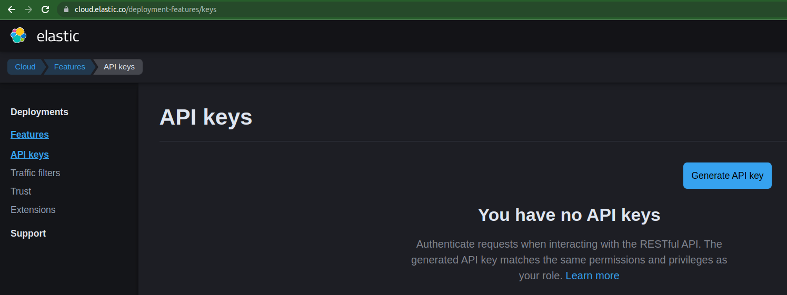

# Elastic Cloud

- [Deployments](https://cloud.elastic.co/deployments)

## API Key 생성

> Cloud > Manage Deployments > Features > API Keys



_[Deployment Features](https://cloud.elastic.co/deployment-features/keys)_

## Terraform을 이용한 Elastic Stack 클러스터 생성

```sh
terraform init
terraform validate
terraform apply -var-file="prod.ec.tfvars" --auto-approve

terraform destroy -var-file="prod.ec.tfvars" --auto-approve
```

## ILM: Index Lifecycle Management (hot-warm-cold)


_[인덱스 수명 주기 관리를 통해 Hot-Warm-Cold 아키텍처 구현](https://www.elastic.co/kr/blog/implementing-hot-warm-cold-in-elasticsearch-with-index-lifecycle-management)_

| lifecycle | description                                                                                                                                          |
| --------- | ---------------------------------------------------------------------------------------------------------------------------------------------------- |
| Hot       | the index is actively being updated and queried.                                                                                                     |
| Warm      | the index is no longer being updated, but is still being queried.                                                                                    |
| Cold      | the index is no longer being updated and is seldom queried. The information still needs to be searchable, but it’s okay if those queries are slower. |
| Delete    | the index is no longer needed and can safely be deleted.                                                                                             |

## 참조

- [Terraform Registry - elastic](https://registry.terraform.io/namespaces/elastic)
  - [ec](https://registry.terraform.io/providers/elastic/ec/0.4.1)
  - [elasticstack](https://registry.terraform.io/providers/elastic/elasticstack/0.3.3)
- [Using Terraform with Elastic Cloud](https://www.elastic.co/blog/using-terraform-with-elastic-cloud) - Elastic Blog
- [Migrating data](https://www.elastic.co/guide/en/cloud/current/ec-migrating-data.html) - Elastic Docs
- [Index Lifecycle](https://www.elastic.co/guide/en/elasticsearch/reference/7.17/ilm-index-lifecycle.html) - Elastic Docs
